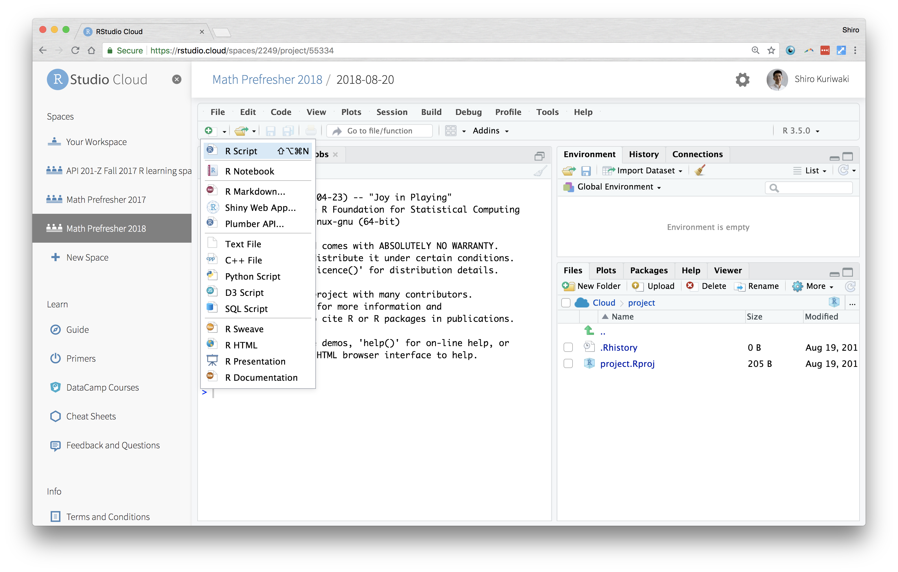
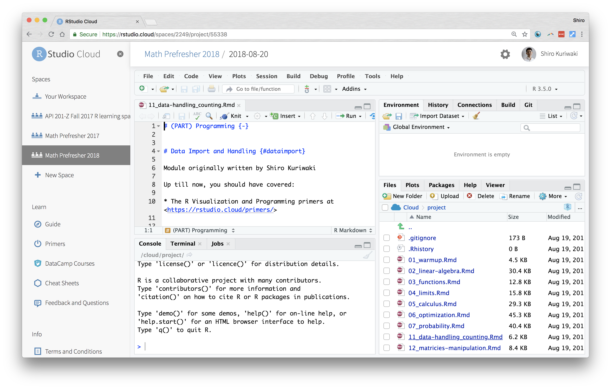
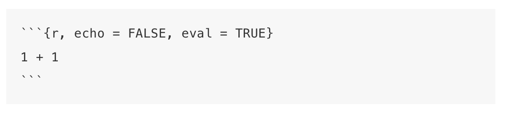

# (PART) Programming {-}


# Orientation and Reading in Data^[Module originally written by Shiro Kuriwaki] {#dataimport}


Up till now, you should have covered:

* The R Visualization and Programming primers at  <https://rstudio.cloud/primers/>

### Where are we? Where are we headed? {-}

Today we'll cover:

* What's what in RStudio
* Reading in Data 
* Comment on coding style on the way

### Check your understanding  {-}

* What is the difference between a file and a folder?
* In the RStudio windows, what is the difference between the "Source" Pane and the "Console"? What is a "code chunk"?
* What use is the "Environment" Pane?
* How would you read in a spreadsheet in R?
* How would you figure out what variables are in the data? size of the data?
* How would you read in a `csv` file, a `dta` file, a `sav` file?


```{r, include = FALSE, message = FALSE}
library(tidyverse)
library(fs)
```

## Motivation: Data and You 

The modal social science project starts by importing existing datasets. Datasets come in all shapes and sizes. As you search for new data you may encounter dozens of file extensions -- csv, xlsx, dta, sav, por, Rdata, Rds, txt, xml, json, shp ... the list continues. Although these files can often be cumbersome, its a good to be able to find a way to encounter any file that your research may call for. 

Reviewing data import will allow us to get on the same page on how computer systems work.


## Orienting

1. We will be using a cloud version of RStudio at <https://rstudio.cloud>. You should join the Math Prefresher Space 2018 from the link that was emailed to you. Each day, click on the project with the day's date on it.

    Although most of you will probably doing your work on RStudio local rather than cloud, we are trying to use cloud because it makes it easier to standardize people's settings.  

2.  RStudio (either cloud or desktop) is a GUI and an IDE for the programming language R. A Graphical User Interface allows users to interface with the software (in this case R) using graphical aids like buttons and tabs. Often we don't think of GUIs because to most computer users, everything is a GUI (like Microsoft Word or your "Control Panel"), but it's always there!

    A Integrated Development Environment just says that the software to interface with R comes with useful useful bells and whistles to give you shortcuts. 

    The __Console__ is kind of a the core window through which you see your GUI actually operating through R. It's not graphical so might not be as intuitive. But all your results, commands, errors, warnings.. you see them in here. A console tells you what's going on now. 


3.  Theoretically, one could do all their work in a Console. But that would be a lot of work, because you'd have to give instructions each time you start your data analysis. Moreover, you'll have no record of what you did. That's why you need a __script__. This is a type of __code__. It can be referred to as a __source__ because that is the source of your commands. Source is also used as a verb; "source the script" just means execute it. 

    RStudio doesn't start out with a script, so you can make one from "File > New" or the New file icon.




4.  You can also open scripts that are in your folder. A script is a type of File. Find your Files in the bottom-right "Files" pane. 



5.   In R, there are two main types of scripts. A classic `.R` file and a `.Rmd` file (for Rmarkdown). A .R file is just lines and lines of R code that is meant to be inserted right into the Console. A .Rmd tries to weave code and English together, to make it easier for users to create reports that interact with data and intersperse R code with explanation. For example, we built this book in Rmds. 

The Rmarkdown facilitates is the use of __code chunks__, which are used here. These start and end with three back-ticks. In the beginning, we can add options in curly braces (`{}`). Specifying `r` in the beginning tells to render it as R code. Options like `echo = TRUE` switch between showing the code that was executed or not; `eval = TRUE` switch between evaluating the code. More about Rmarkdown in Section \@ref(nonwysiwyg).
  
For example:




This code chunk would evaluate `1 + 1` and show its output when compiled, but not display the code that was executed.


## The Computer and You: Giving Instructions

We'll do the Peanut Butter and Jelly Exercise in class as an introduction to programming for those who are new.^[This Exercise is taken from Harvard's Introductory Undergraduate Class, CS50 (<https://www.youtube.com/watch?v=kcbT3hrEi9s>), and many other writeups.]

Assignment: Take 5 minutes to write down on a piece of paper, how to make a peanut butter and jelly sandwhich. Be as concise and unambiguous as possible so that a robot (who doesn't know what a PBJ is) would understand. You can assume that there'll be loaf of sliced bread, a jar of jelly, a jar of peanut butter, and a knife. 


## A is for Athens

For our first dataset, let's try reading in a dataset on the Ancient Greek world. Political Theorists and Political Historians study the domestic systems, international wars, cultures and writing of this era to understand the first instance of democracy, the rise and overturning of tyranny, and the legacies of political institutions. 

This POLIS dataset was generously provided by Professor Josiah Ober of Stanford University. This dataset includes information on city states in the Ancient Greek world, parts of it collected by careful work by historians and archaeologists. It is part of his recent books on Greece (Ober 2015), "The Rise and Fall of Classical Greece"^[[Ober, Josiah (2015). _The Rise and Fall of Classical Greece_. Princeton University Press.](https://press.princeton.edu/titles/10423.html)] and Institutions in Ancient Athens (Ober 2010) , "Democracy and Knowledge: Innovation and Learning in Classical Athens"^[[Ober, Josiah (2010). _Democracy and Knowledge: Innovation and Learning in Classical Athens_. Princeton University Press.](https://press.princeton.edu/titles/8742.html)]

### Preliminaries 
What files do we have in the `input` folder?

```{r, echo = FALSE}
dir_ls("input")
```

A typical file format is Microsoft Excel. Although this is not usually the best format for R because of its highly formatted structure as opposed to plain text (more on this in Section \ref@(sec:wysiwyg)), recent packages have made this fairly easy. 

For the first time using an outside package, you first need to install it. 
```{r, eval = FALSE}
install.packages("readxl")
```

After that, you don't need to install it again. But you do need to load it. 

```{r}
library(readxl)
```

The package `readxl` has a website: https://readxl.tidyverse.org/. Other packages are not as user-friendly, but they have a help page with a table of contents of all their functions. 

```{r, eval = FALSE}
help(package = readxl)
```

Many things in R and other open source packages have competing standards. A lecture on a technique inevitably biases one standard over another. We try our best to choose the one that is most relevant and useful, but feel free to suggest changes to us or to the booklet. 


### Reading in Data

From the help page, we see that `read_excel()` is the function that we want to use.  Look at the help page. How do you read a help page?

Let's try it. 

```{r}
ober <- read_excel("input/complete_greek_data 5 DISTRIBUTION 2018.xlsx")
```

What does the `/` mean?  Why do we need the `input` term first? Does the argument need to be in quotes?


### Inspecting 

For almost any dataset, you usually want to do a couple of standard checks first to understand what you loaded.


```{r}
ober
```


```{r}
dim(ober)
```

From your tutorials, you also know how to do graphics! Graphics are useful for grasping your data, but we will cover them more deeply in Chapter \@ref(dataviz).

```{r}
ggplot(ober, aes(x = Fame)) + geom_histogram()
```

What about the distribution of fame by regime?
```{r}
ggplot(ober, aes(y = Fame, x = factor(Regime), group = factor(Regime))) +
  geom_boxplot()
```

What do the 1's, 2's, and 3's stand for? 

### Finding observations


These `tidyverse` commands from the `dplyr` package are newer and not built-in, but they are one of the increasingly more popular ways to wrangle data. 

* 80 percent of your data wrangling needs might be doable with these basic `dplyr` functions: `select`, `mutate`, `group_by`, `summarize`, and `arrange`.
* These verbs roughly correspond to the same commands in SQL, another important language in data science. 
* The `%>%` symbol is a pipe. It takes the thing on the left side and pipes it down to the function on the right side. We could have done `count(cen10, race)` as `cen10 %>% count(race)`. That means take `cen10` and pass it on to the function `count`, which will count observations by race and return a collapsed dataset with the categories in its own variable and their respective counts in `n`.


### Extra: A sneak peak at Ober's data


Although this is a bit beyond our current stage, it's hard to resist the temptation to see what you can do with data like this.  For example, you can map it. 

Using the `ggmap` package
```{r}
library(ggmap)
```

First get a map of the Greek world.
```{r, message=FALSE, warning=FALSE}
greece <- get_map(location = c(lat = 39.543287, lon = 22.6382849),
                  zoom = 5, 
                  source = "stamen",
                  maptype = "toner")
ggmap(greece)
```

I chose the specifications for arguments `zoom` and `maptype` by looking at the webpage and Googling some examples/ 


Ober's data has the latitude and longitude of each polis. Because the map of Greece has the same coordinates, we can add the polei on the same map. 

```{r, warning=FALSE}
gg_ober <- ggmap(greece) +
  geom_point(data = ober, 
             aes(y = Latitude, x = Longitude), 
             size = 0.5,
             alpha = 0.5,
             color = "gray")
gg_ober
```

We can also color the points by another variable, like Fame. 

```{r, warning=FALSE}
gg_ober_fame <- ggmap(greece) +
  geom_point(data = ober, 
             aes(y = Latitude, x = Longitude, color = Fame)) +
  scale_color_gradient(low = "white", high = "indianred")
gg_ober_fame
```


## Exercises {-}

### 1 {-}

What is the Fame value of Delphoi?

```{r}
# Enter here
```


### 2 {-}

Find the polis with the top 10 Fame values.

```{r}
# Enter here
```


### 3 {-}

Make a scatterplot with the number of colonies on the x-axis and Fame on the y-axis.

```{r}
# Enter here
```


### 4 {-}
Find the right function to read the following datasets into your R window. 


* `input/acs2015_1percent.csv`: A one percent sample of the American Community Survey
* `input/gapminder_wide.tab`: Country-level wealth and health from Gapminder^[Formatted and taken from <https://doi.org/10.7910/DVN/GJQNEQ>]
* `input/gapminder_wide.Rds`: A Rds version of the Gapminder (What is a Rds file? What's the difference?)
* `input/Nunn_Wantchekon_sample.dta`: A sample from the Afrobarometer survey (which we'll explore tomorrow). `.dta` is a Stata format. 
* `input/german_credit.sav`: A hypothetical dataset on consumer credit. `.sav` is a SPSS format. 

Our Recommendations: Look at the packages `haven` and `readr`


```{r}
# Enter here, perhaps making a chunk for each file.
```


### 5 {-}
Read Ober's codebook and find a variable that you think is interesting. Check the distribution of that variable in your data, get a couple of statistics, and summarize it in English.

```{r}
# Enter here
```


### 6 {-}
This is day 1 and we covered a lot of material. Some of you might have found this completely new; others not so. Please click through this survey before you leave so we can adjust accordingly on the next few days.

<https://harvard.az1.qualtrics.com/jfe/form/SV_8As7Y7C83iBiQzH>
