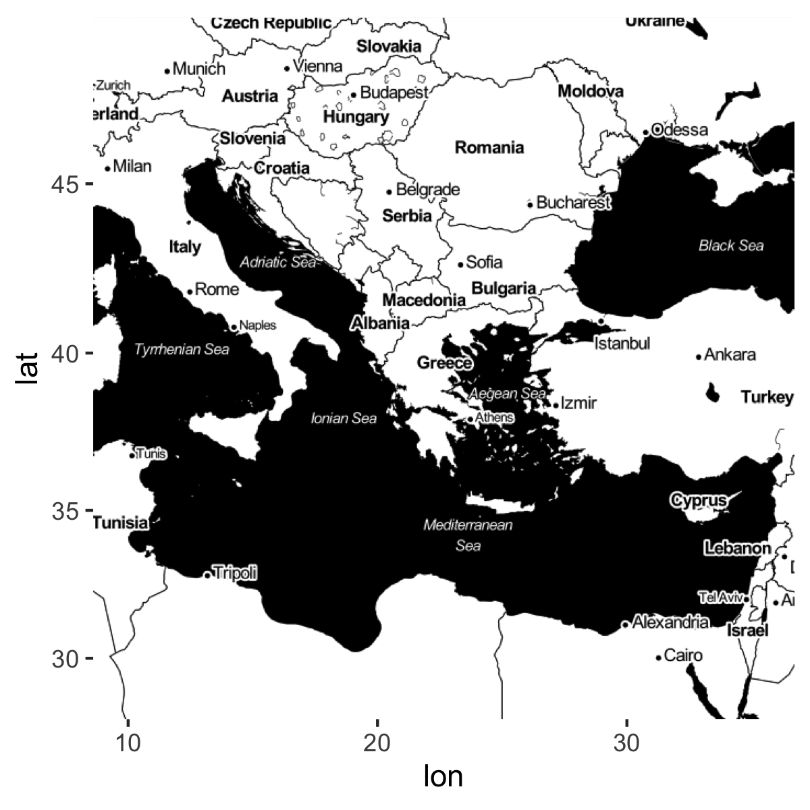

# (PART) Programming {-}


# Orientation and Reading in Data^[Module originally written by Shiro Kuriwaki] {#dataimport}


Welcome to the first in-class session for programming. Up till this point, you should have already:

* Completed the R Visualization and Programming primers (under "The Basics") on your own at <https://rstudio.cloud/learn/primers/>,
* Made an account at RStudio Cloud and join the Math Prefresher 2019 Space, and
* Successfully signed up for the University wi-fi: <https://getonline.harvard.edu/> (Access Harvard Secure with your HarvardKey. Try to get a HarvardKey as soon as possible.)


## Motivation: Data and You {-}

The modal social science project starts by importing existing datasets. Datasets come in all shapes and sizes. As you search for new data you may encounter dozens of file extensions -- csv, xlsx, dta, sav, por, Rdata, Rds, txt, xml, json, shp ... the list continues. Although these files can often be cumbersome, its a good to be able to find a way to encounter any file that your research may call for. 

Reviewing data import will allow us to get on the same page on how computer systems work.


### Where are we? Where are we headed? {-}

Today we'll cover:

* What's what in RStudio
* What R is, at a high level
* How to read in data 
* Comment on coding style on the way

### Check your understanding  {-}

* What is the difference between a file and a folder?
* In the RStudio windows, what is the difference between the "Source" Pane and the "Console"? What is a "code chunk"?
* How do you read a R help page? What is the `Usage` section, the `Values` section, and the `Examples` section?
* What use is the "Environment" Pane?
* How would you read in a spreadsheet in R?
* How would you figure out what variables are in the data? size of the data?
* How would you read in a `csv` file, a `dta` file, a `sav` file?


```{r, include = FALSE, message = FALSE}
library(ggplot2)
library(dplyr)
library(fs)
```


## Orienting

1. We will be using a cloud version of RStudio at <https://rstudio.cloud>. You should join the Math Prefresher Space 2019 from the link that was emailed to you. Each day, click on the project with the day's date on it.

    Although most of you will probably doing your work on RStudio local rather than cloud, we are trying to use cloud because it makes it easier to standardize people's settings.  

2.  RStudio (either cloud or desktop) is a __GUI__ and an IDE for the programming language R. A Graphical User Interface allows users to interface with the software (in this case R) using graphical aids like buttons and tabs. Often we don't think of GUIs because to most computer users, everything is a GUI (like Microsoft Word or your "Control Panel"), but it's always there! A Integrated Development Environment just says that the software to interface with R comes with useful useful bells and whistles to give you shortcuts. 

    The __Console__ is kind of a the core window through which you see your GUI actually operating through R. It's not graphical so might not be as intuitive. But all your results, commands, errors, warnings.. you see them in here. A console tells you what's going on now. 


3. via the GUI, you the analyst needs to sends instructions, or __commands__, to the R application. The verb for this is "run" or "execute" the command. Computer programs ask users to provide instructions in very specific formats. While a English-speaking human can understand a sentence with a few typos in it by filling in the blanks, the same typo or misplaced character would halt a computer program. Each program has its own requirements for how commands should be typed; after all, each of these is its own language. We refer to the way a program needs its commands to be formatted as its __syntax__. 


4.  Theoretically, one could do all their work by typing in commands into the Console. But that would be a lot of work, because you'd have to give instructions each time you start your data analysis. Moreover, you'll have no record of what you did. That's why you need a __script__. This is a type of __code__. It can be referred to as a __source__ because that is the source of your commands. Source is also used as a verb; "source the script" just means execute it.  RStudio doesn't start out with a script, so you can make one from "File > New" or the New file icon.


4.  You can also open scripts that are in folders in your computer. A script is a type of File. Find your Files in the bottom-right "Files" pane. 

    To load a dataset, you need to specify where that file is. Computer files (data, documents, programs) are organized hiearchically, like a branching tree. Folders can contain files, and also other folders.   The GUI toolbar makes this lineaer and hiearchical relationship apparent. When we turn to locate the file in our commands, we need another set of syntax. Importantly, denote the hierarchy of a folder by the `/` (slash) symbol. `data/input/2018-08` indicates the `2018-08` folder, which is included in the `input` folder, which is in turn included in the `data` folder. 

    Files (but not folders) have "file extensions" which you are probably familiar with already: `.docx`, `.pdf`, and `.pdf`. The file extensions you will see in a stats or quantitative social science class are:
    
    * `.pdf`: PDF, a convenient format to view documents and slides in, regardless of Mac/Windows.
    * `.csv`: A comma separated values file
    * `.xlsx`: Microsoft Excel file
    * `.dta`: Stata data
    * `.sav`: SPSS data
    
    * `.R`: R code (script)
    * `.Rmd`: Rmarkdown code (text + code)
    * `.do`: Stata code (script)


5.   In R, there are two main types of scripts. A classic `.R` file and a `.Rmd` file (for Rmarkdown). A .R file is just lines and lines of R code that is meant to be inserted right into the Console. A .Rmd tries to weave code and English together, to make it easier for users to create reports that interact with data and intersperse R code with explanation. For example, we built this book in Rmds. 

    The Rmarkdown facilitates is the use of __code chunks__, which are used here. These start and end with three back-ticks. In the beginning, we can add options in curly braces (`{}`). Specifying `r` in the beginning tells to render it as R code. Options like `echo = TRUE` switch between showing the code that was executed or not; `eval = TRUE` switch between evaluating the code. More about Rmarkdown in Section \@ref(nonwysiwyg). For example, this code chunk would evaluate `1 + 1` and show its output when compiled, but not display the code that was executed.


\newpage
## But what is R?
R is an object oriented programming language primarily used for statistical computing. An object oriented language is a programming language built around manipulating objects. 

* In R, objects can be matrices, vectors, scalars, strings, and data frames, for example
* Objects contain different types of information
* Different objects have different allowable procedures:

```{r}
# Adding a string and a string does not work because the '+' operator 
# does not work for strings:

# 'Harvard' + 'Gov'

# The '+' operator can add numbers just fine
9 + 13

# Reminder: to figure out the type of an object use:
x <- 9
class(9)
class(x)
class('Harvard')
```

Object oriented programming makes languages flexible and powerful:

* You can create custom functions and objects for your needs
* Other people can create great packages for everyone to use
* Many errors come from using the wrong data type and a lot of programming in R is getting data into the right format and type to work with.

It is helpful to think in terms of object manipulation at a high level while programming in R, particularly at the beginning of tackling a new problem. Think about what objects you want to manipulate, what types they are, and how they fit together. Once you have the logic of your solution ready then you can write it in R.


## The Computer and You: Giving Instructions

We'll do the Peanut Butter and Jelly Exercise in class as an introduction to programming for those who are new.^[This Exercise is taken from Harvard's Introductory Undergraduate Class, CS50 (<https://www.youtube.com/watch?v=kcbT3hrEi9s>), and many other writeups.]

Assignment: Take 5 minutes to write down on a piece of paper, how to make a peanut butter and jelly sandwich. Be as concise and unambiguous as possible so that a robot (who doesn't know what a PBJ is) would understand. You can assume that there will be loaf of sliced bread, a jar of jelly, a jar of peanut butter, and a knife. 

Simpler assignment: Say we just want a robot to be able to tell us if we have enough ingredients to make a peanut butter and jelly sandwich. Write down instructions so that if told how many slices of bread, servings of peanut butter, and servings of jelly you have, the robot can tell you if you can make a PBJ.

Now, translate the simpler assignment into R code using the code below as a starting point:

```{r}
n_bread <- 8
n_pb <- 3
n_jelly <- 9

# write instructions in R here


```


## Base-R vs. tidyverse 

One last thing before we jump into data. Many things in R and other open source packages have competing standards. A lecture on a technique inevitably biases one standard over another. Right now among R users in this area, there are two families of functions: base-R and tidyverse.  R instructors thus face a dilemma about which to teach primarily.^[See for example this community discussion: https://community.rstudio.com/t/base-r-and-the-tidyverse/2965/17]

In this prefresher, we try our best to choose the one that is most useful to the modal task of social science researchers, and make use of the tidyverse functions in most applications. but feel free to suggest changes to us or to the booklet. 

Although you do not need to choose one over the other, for beginners it is confusing what is a tidyverse function and what is not. Many of the tidyverse _packages_ are covered in this 2017 graphic below, and the cheat-sheets that other programmers have written: https://www.rstudio.com/resources/cheatsheets/


The following side-by-side comparison of commands for a particular function compares some tidyverse and non-tidyverse functions (which we refer to loosely as base-R). This list is not meant to be comprehensive and more to give you a quick rule of thumb.

### Dataframe subsetting {-}

| In order to ...        | in tidyverse: | in base-R:  |
|----------------------|:------------------------|:----------------------|
| Count each category | `count(df, var)` | `table(df$var)`|
| Filter rows by condition | `filter(df, var == "Female") ` | `df[df$var == "Female", ]` or `subset(df, var == "Female")` |
| Extract columns | `select(df, var1, var2)`| `df[, c("var1", "var2")]` |
| Extract a single column as a vector |  `pull(df, var)` | `df[["var"]]` or `df[, "var"]` |
| Combine rows | `bind_rows()` | `rbind()` |
| Combine columns | `bind_cols()` | `cbind()` |
| Create a dataframe | `tibble(x = vec1, y = vec2)`| `data.frame(x = vec1, y = vec2)` |
| Turn a dataframe into a tidyverse dataframe | `tbl_df(df)` | |


Remember that tidyverse applies to _dataframes_ only, not vectors. For subsetting vectors, use the base-R functions with the square brackets.


### Read data {-}

Some non-tidyverse functions are not quite "base-R" but have similar relationships to tidyverse. For these, we recommend using the _tidyverse_ functions as a general rule due to their common format, simplicity, and scalability. 

| In order to ...        | in tidyverse: | in base-R:  |
|----------------------|:------------------------|:----------------------|
| Read a Excel file | `read_excel()` | `read.xlsx()` |
| Read a csv | `read_csv()` | `read.csv()` |
| Read a Stata file |  `read_dta()` | `read.dta()` |
| Substitute strings | `str_replace()` | `gsub()` |
| Return matching strings | `str_subset()` | `grep(., value = TRUE)` |
| Merge `data1` and `data2` on variables  `x1` and `x2` | `left_join(data1, data2, by = c("x1", "x2"))` | `merge(data1, data2, by.x = "x1", by.y = "x2", all.x = TRUE)` |


### Visualization {-}

Plotting by ggplot2 (from your tutorials) is also a tidyverse family.

| In order to ...        | in tidyverse: | in base-R:  |
|----------------------|:------------------------|:----------------------|
| Make a scatter plot | `ggplot(data, aes(x, y)) + geom_point()` | `plot(data$x, data$y)` |
| Make a line plot | `ggplot(data, aes(x, y)) + geom_line()` | `plot(data$x, data$y, type = "l")` |
| Make a histogram | `ggplot(data, aes(x, y)) + geom_histogram()` | `hist(data$x, data$y)` |
| Make a barplot | See Section \@ref(dataviz) | See Section \@ref(dataviz)|


## A is for Athens

For our first dataset, let's try reading in a dataset on the Ancient Greek world. Political Theorists and Political Historians study the domestic systems, international wars, cultures and writing of this era to understand the first instance of democracy, the rise and overturning of tyranny, and the legacies of political institutions. 

This POLIS dataset was generously provided by Professor Josiah Ober of Stanford University. This dataset includes information on city states in the Ancient Greek world, parts of it collected by careful work by historians and archaeologists. It is part of his recent books on Greece (Ober 2015), "The Rise and Fall of Classical Greece"^[[Ober, Josiah (2015). _The Rise and Fall of Classical Greece_. Princeton University Press.](https://press.princeton.edu/titles/10423.html)] and Institutions in Ancient Athens (Ober 2010) , "Democracy and Knowledge: Innovation and Learning in Classical Athens."^[[Ober, Josiah (2010). _Democracy and Knowledge: Innovation and Learning in Classical Athens_. Princeton University Press.](https://press.princeton.edu/titles/8742.html)]

### Locating the Data 
What files do we have in the `data/input` folder?

```{r, echo = FALSE}
dir_ls("data/input")
```

A typical file format is Microsoft Excel. Although this is not usually the best format for R because of its highly formatted structure as opposed to plain text (more on this in Section \ref@(sec:wysiwyg)), recent packages have made this fairly easy. 


### Reading in Data


In Rstudio, a good way to start is to use the GUI and the Import tool. Once you click a file, an option to "Import Dataset" comes up. RStudio picks the right function for you, and you can copy that code, but it's important to eventually be able to write that code yourself. 

For the first time using an outside package, you first need to install it. 
```{r, eval = FALSE}
install.packages("readxl")
```

After that, you don't need to install it again. But you __do__ need to load it each time. 

```{r, eval = FALSE}
library(readxl)
```

The package `readxl` has a website: https://readxl.tidyverse.org/. Other packages are not as user-friendly, but they have a help page with a table of contents of all their functions. 

```{r, eval = FALSE}
help(package = readxl)
```

From the help page, we see that `read_excel()` is the function that we want to use. 

Let's try it. 

```{r}
library(readxl)
ober <- read_excel("data/input/ober_2018.xlsx")
```

Review: what does the `/` mean?  Why do we need the `data` term first? Does the argument need to be in quotes? 


### Inspecting 

For almost any dataset, you usually want to do a couple of standard checks first to understand what you loaded.


```{r}
ober
```


```{r}
dim(ober)
```

From your tutorials, you also know how to do graphics! Graphics are useful for grasping your data, but we will cover them more deeply in Chapter \@ref(dataviz).

```{r}
ggplot(ober, aes(x = Fame)) + geom_histogram()
```

What about the distribution of fame by regime?
```{r}
ggplot(ober, aes(y = Fame, x = Regime, group = Regime)) +
  geom_boxplot()
```

What do the 1's, 2's, and 3's stand for? 

### Finding observations

These `tidyverse` commands from the `dplyr` package are newer and not built-in, but they are one of the increasingly more popular ways to wrangle data. 

* 80 percent of your data wrangling needs might be doable with these basic `dplyr` functions: `select`, `mutate`, `group_by`, `summarize`, and `arrange`.
* These verbs roughly correspond to the same commands in SQL, another important language in data science. 
* The `%>%` symbol is a pipe. It takes the thing on the left side and pipes it down to the function on the right side. We could have done `count(cen10, race)` as `cen10 %>% count(race)`. That means take `cen10` and pass it on to the function `count`, which will count observations by race and return a collapsed dataset with the categories in its own variable and their respective counts in `n`.


### Extra: A sneak peak at Ober's data


Although this is a bit beyond our current stage, it's hard to resist the temptation to see what you can do with data like this.  For example, you can map it.^[In mid-2018, changes in Google's services made it no longer possible to render maps on the fly. Therefore, the map is not currently rendered automatically (but can be rendered once the user registers their API).  Instead, you now need to register with Google. See the [change](https://github.com/dkahle/ggmap/blob/e55c0b22b0d16a010b4b45dd2fce800ff0ef19b8/NEWS#L6-L12) to the pacakge ggmap.]

Using the `ggmap` package
```{r message=FALSE, warning=FALSE, eval = FALSE}
library(ggmap)
```

First get a map of the Greek world.
```{r, message=FALSE, warning=FALSE, eval = FALSE}
greece <- get_map(location = c(lon = 22.6382849, lat = 39.543287),
                  zoom = 5, 
                  source = "stamen",
                  maptype = "toner")
ggmap(greece)
```


I chose the specifications for arguments `zoom` and `maptype` by looking at the webpage and Googling some examples.


Ober's data has the latitude and longitude of each polis. Because the map of Greece has the same coordinates, we can add the polei on the same map. 

```{r, warning=FALSE, eval = FALSE}
gg_ober <- ggmap(greece) +
  geom_point(data = ober, 
             aes(y = Latitude, x = Longitude), 
             size = 0.5,
             color = "orange")
gg_ober + 
  scale_x_continuous(limits = c(10, 35)) + 
  scale_y_continuous(limits = c(32, 44)) +
  theme_void()
```


## Exercises {-}

### 1 {-}

What is the Fame value of Delphoi?

```{r}
# Enter here
```


### 2 {-}

Find the polis with the top 10 Fame values.

```{r}
# Enter here
```


### 3 {-}

Make a scatterplot with the number of colonies on the x-axis and Fame on the y-axis.

```{r}
# Enter here
```


### 4 {-}
Find the correct function to read the following datasets (available in your rstudio.cloud session) into your R window.


* `data/input/acs2015_1percent.csv`: A one percent sample of the American Community Survey
* `data/input/gapminder_wide.tab`: Country-level wealth and health from Gapminder^[Formatted and taken from <https://doi.org/10.7910/DVN/GJQNEQ>]
* `data/input/gapminder_wide.Rds`: A Rds version of the Gapminder (What is a Rds file? What's the difference?)
* `data/input/Nunn_Wantchekon_sample.dta`: A sample from the Afrobarometer survey (which we'll explore tomorrow). `.dta` is a Stata format. 
* `data/input/german_credit.sav`: A hypothetical dataset on consumer credit. `.sav` is a SPSS format. 

Our Recommendations: Look at the packages `haven` and `readr`


```{r}
# Enter here, perhaps making a chunk for each file.
```


### 5 {-}
Read Ober's codebook and find a variable that you think is interesting. Check the distribution of that variable in your data, get a couple of statistics, and summarize it in English.

```{r}
# Enter here
```


### 6 {-}
This is day 1 and we covered a lot of material. Some of you might have found this completely new; others not so. Please click through this survey before you leave so we can adjust accordingly on the next few days.

<https://harvard.az1.qualtrics.com/jfe/form/SV_8As7Y7C83iBiQzH>
