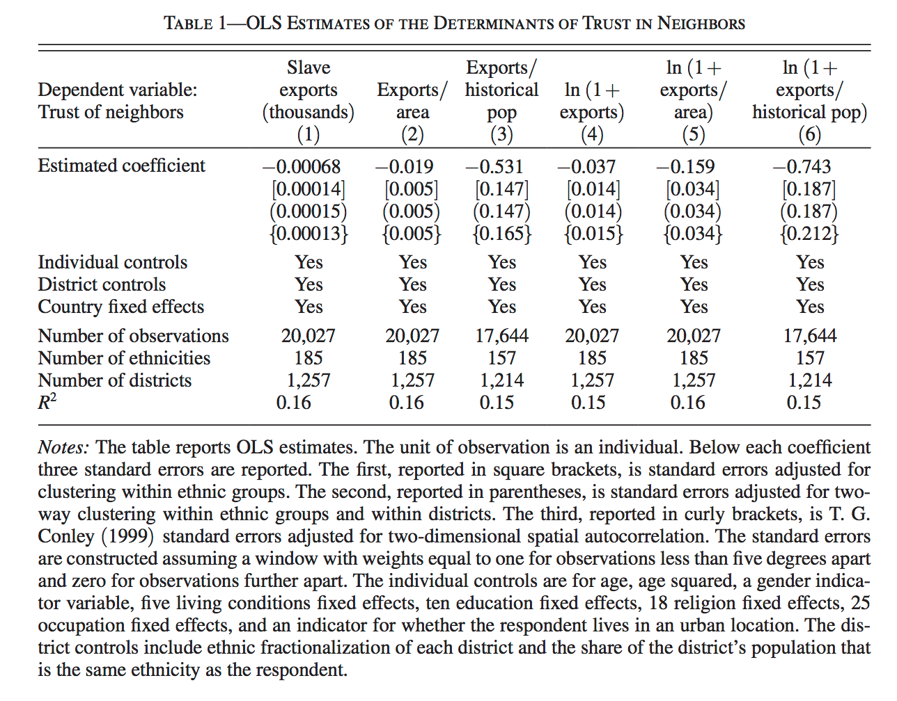

#  Manipulating Vectors and  Matrices^[Module originally written by Shiro Kuriwaki and Yon Soo Park] {#rmatrices}

```{r, include=FALSE, message = FALSE, warning = FALSE}
library(dplyr)
library(readr)
library(haven)
library(ggplot2)
```

### Motivation {-}

[Nunn and Wantchekon (2011)](https://dash.harvard.edu/bitstream/handle/1/11986331/nunn-slave-trade.pdf) --  "The Slave Trade and the Origins of Mistrust in Africa"^[[Nunn, Nathan, and Leonard Wantchekon. 2011. “The Slave Trade and the Origins of Mistrust in Africa.” American Economic Review 101(7): 3221–52.](https://dash.harvard.edu/bitstream/handle/1/11986331/nunn-slave-trade.pdf)] --  argues that across African countries, the distrust of co-ethnics fueled by the slave trade has had long-lasting effects on modern day trust in these territories. They argued that the slave trade created distrust in these societies in part because as some African groups were employed by European traders to capture their neighbors and bring them to the slave ships.

Nunn and Wantchekon use a variety of statistical tools to make their case (adding controls, ordered logit, instrumental variables, falsification tests, causal mechanisms), many of which will be covered in future courses. In this module we will only touch on their first set of analysis that use Ordinary Least Squares (OLS). OLS is likely the most common application of linear algebra in the social sciences. We will cover some linear algebra, matrix manipulation, and vector manipulation from this data. 


### Where are we? Where are we headed? {-}

Up till now, you should have covered:

* R basic programming
* Data Import
* Statistical Summaries.


Today we'll cover

* Matrices & Dataframes in R
* Manipulating variables 
* And other `R` tips


## Read Data


```{r}
library(haven)
nunn_full <- read_dta("data/input/Nunn_Wantchekon_AER_2011.dta")
```


Nunn and Wantchekon's main dataset has more than 20,000 observations. Each observation is a respondent from the Afrobarometer survey.
```{r}
head(nunn_full)
colnames(nunn_full)
```


First, let's consider a small subset of this dataset. 
```{r, include = FALSE, eval = FALSE}
set.seed(02138)
sample <- sample_n(nunn_full, 10)
sample <- select(sample, trust_neighbors, exports, ln_exports, export_area, ln_export_area)
write_dta(sample, "data/input/Nunn_Wantchekon_sample.dta")
```

```{r}
nunn <- read_dta("data/input/Nunn_Wantchekon_sample.dta")
```

```{r}
nunn
```


## data.frame vs. matricies
This is a `data.frame` object. 
```{r}
class(nunn)
```


But it can be also consider a matrix in the linear algebra sense. What are the dimensions of this matrix?
```{r}
nrow(nunn)
```

`data.frame`s and matrices have much overlap in `R`, but to explicitly treat an object as a matrix, you'd need to coerce its class. Let's call this matrix `X`.

```{r}
X <- as.matrix(nunn)
```


What is the difference between a `data.frame` and a matrix? A `data.frame` can have columns that are of different types, whereas --- in a matrix --- all columns must be of the same type (usually either "numeric" or "character").


You can think of data frames maybe as matrices-plus, because a column can take on characters as well as numbers. As we just saw, this is often useful for real data analyses.


Another way to think about data frames is that it is a type of list. Try the `str()` code below and notice how it is organized in slots. Each slot is a vector. They can be vectors of numbers or characters.
```{r, eval = FALSE}
# enter this on your console
str(cen10)
```


## Handling matricies in `R`

You can easily transpose a matrix
```{r}
X
t(X)
```


What are the values of all rows in the first column? 
```{r}
X[, 1]
```

What are all the values of "exports"? (i.e. return the whole "exports" column)
```{r}
X[, "exports"]
```

What is the first observation (i.e. first row)?
```{r}
X[1, ]
```

What is the value of the first variable of the first observation?
```{r}
X[1, 1]
```

Pause and consider the following problem on your own. What is the following code doing? 
```{r}
X[X[, "trust_neighbors"] == 0, "export_area"]
```
Why does it give the same output as the following? 
```{r}
X[which(X[, "trust_neighbors"] == 0), "export_area"]
```


Some more manipulation 
```{r}
X + X
```

```{r}
X - X
```

```{r}
t(X) %*% X
```

```{r}
cbind(X, 1:10)
```

```{r}
cbind(X, 1)
```


```{r}
colnames(X)
```


## Variable Transformations

`exports` is the total number of slaves that were taken from the individual's ethnic group between Africa's four slave trades between 1400-1900. 

What is `ln_exports`? The article describes this as the natural log of one plus the `exports`. This is a transformation of one column by a particular function

```{r}
log(1 + X[, "exports"])
```
Question for you: why add the 1? 

Verify that this is the same as `X[, "ln_exports"]`


## Linear Combinations

In Table 1 we see "OLS Estimates". These are estimates of OLS coefficients and standard errors. You do not need to know what these are for now, but it doesn't hurt to getting used to seeing them. 



A very crude way to describe regression is through linear combinations. The simplest linear combination is a one-to-one transformation.

Take the first number in Table 1, which is -0.00068. Now, multiply this by `exports`

```{r}
-0.00068 * X[, "exports"]
```


Now, just one more step. Make a new matrix with just exports and the value 1
```{r}
X2 <- cbind(1, X[, "exports"])
```

name this new column "intercept"

```{r}
colnames(X2)
```

```{r}
colnames(X2) <- c("intercept", "exports")
```


What are the dimensions of the matrix `X2`?
```{r}
dim(X2)
```


Now consider a new matrix, called `B`.

```{r}
B <- matrix(c(1.62, -0.00068))
```

What are the dimensions of `B`?
```{r}
dim(B)
```


What is the product of `X2` and `B`? From the dimensions, can you tell if it will be conformable?
```{r}
X2 %*% B
```

What is this multiplication doing in terms of equations?


```{r, echo = FALSE, eval = FALSE}
## FYI regression in Table 1 (without cluster SEs)

form <- "trust_neighbors ~ exports + age + age2 +  male + urban_dum + factor(education) + factor(occupation) + factor(religion) + factor(living_conditions) + district_ethnic_frac + frac_ethnicity_in_district + isocode"
lm_1_1 <- lm(as.formula(form), nunn_full)
summary(lm_1_1)
```


## Matrix Basics


Let's take a look at Matrices in the context of R

```{r, message = FALSE}
cen10 <- read_csv("data/input/usc2010_001percent.csv")
head(cen10)
```

What is the dimension of this dataframe? What does the number of rows represent? What does the number of columns represent?
```{r, message = FALSE}
dim(cen10)
nrow(cen10)
ncol(cen10)
```


What variables does this dataset hold? What kind of information does it have?

```{r, message = FALSE}
colnames(cen10)
```

We can access column vectors, or vectors that contain values of variables by using the $ sign

```{r, message = FALSE}
head(cen10$state)

head(cen10$race)
```

We can look at a unique set of variable values by calling the unique function


```{r, message = FALSE}
unique(cen10$state)
```

How many different states are represented (this dataset includes DC as a state)? 

```{r, message = FALSE}
length(unique(cen10$state))
```

Matrices are rectangular structures of numbers (they have to be numbers, and they can't be characters).

A cross-tab can be considered a matrix:
```{r}
table(cen10$race, cen10$sex)
```


```{r}
cross_tab <- table(cen10$race, cen10$sex)
dim(cross_tab)
cross_tab[6, 2]
```


But a subset of your data -- individual values-- can be considered a matrix too. 


```{r, warning = FALSE}
# First 20 rows of the entire data
# Below two lines of code do the same thing
cen10[1:20, ]

cen10 %>% slice(1:20)

# Of the first 20 rows of the entire data, look at values of just race and age
# Below two lines of code do the same thing
cen10[1:20, c("race", "age")]

cen10 %>% slice(1:20) %>% select(race, age)
```

A vector is a special type of matrix with only one column or only one row 
```{r}

# One column
cen10[1:10, c("age")]

cen10 %>% slice(1:10) %>% select(c("age"))

# One row
cen10[2, ]

cen10 %>% slice(2)
```

What if we want a special subset of the data? For example, what if I only want the records of individuals in California? What if I just want the age and race of individuals in California?
```{r}
# subset for CA rows
ca_subset <- cen10[cen10$state == "California", ]

ca_subset_tidy <- cen10 %>% filter(state == "California")

all_equal(ca_subset, ca_subset_tidy)

# subset for CA rows and select age and race
ca_subset_age_race <- cen10[cen10$state == "California", c("age", "race")]

ca_subset_age_race_tidy <- cen10 %>% filter(state == "California") %>% select(age, race)

all_equal(ca_subset_age_race, ca_subset_age_race_tidy)
```

Some common operators that can be used to filter or to use as a condition. Remember, you can use the unique function to look at the set of all values a variable holds in the dataset. 
```{r}
# all individuals older than 30 and younger than 70
s1 <- cen10[cen10$age > 30 & cen10$age < 70, ]
s2 <- cen10 %>% filter(age > 30 & age < 70)
all_equal(s1, s2)

# all individuals in either New York or California
s3 <- cen10[cen10$state == "New York" | cen10$state == "California", ]
s4 <- cen10 %>% filter(state == "New York" | state == "California")
all_equal(s3, s4)


# all individuals in any of the following states: California, Ohio, Nevada, Michigan
s5 <- cen10[cen10$state %in% c("California", "Ohio", "Nevada", "Michigan"), ]
s6 <- cen10 %>% filter(state %in% c("California", "Ohio", "Nevada", "Michigan"))
all_equal(s5, s6)

# all individuals NOT in any of the following states: California, Ohio, Nevada, Michigan
s7 <- cen10[!(cen10$state %in% c("California", "Ohio", "Nevada", "Michigan")), ]
s8 <- cen10 %>% filter(!state %in% c("California", "Ohio", "Nevada", "Michigan"))
all_equal(s7, s8)
```

## Checkpoint {-}


### 1 {-}
Get the subset of cen10 for non-white individuals (Hint: look at the set of values for the race variable by using the unique function)
```{r}
# Enter here
```

### 2 {-}
Get the subset of cen10 for females over the age of 40
```{r}
# Enter here
```


### 3 {-}
Get all the serial numbers for black, male individuals who don't live in Ohio or Nevada.
```{r}
# Enter here
```


## Exercises {-}

### 1 {-}

Let
\[\mathbf{A} = \left[\begin{array}
{rrr}
0.6 & 0.2\\
0.4 & 0.8\\
\end{array}\right]
\]

Use R to write code that will create the matrix $A$, and then  consecutively multiply $A$ to itself 4 times. What is the value of $A^{4}$? 

```{r}
## Enter yourself
```


Note that R notation of matrices is different from the math notation. Simply trying `X^n` where `X` is a matrix will only take the power of each element to `n`. Instead, this problem asks you to perform matrix multiplication.


### 2 {-}
Let's apply what we learned about subsetting or filtering/selecting. Use the `nunn_full` dataset you have already loaded

a) First, show all observations (rows) that have a `"male"` variable higher than 0.5

```{r}
## Enter yourself
```

b) Next, create a matrix / dataframe with only two columns: `"trust_neighbors"` and `"age"`

```{r}
## Enter yourself
```

c) Lastly, show all values of `"trust_neighbors"` and `"age"` for observations (rows) that have the "male" variable value that is higher than 0.5

```{r}
## Enter yourself
```

### 3 {-}

Find a way to generate a vector of "column averages" of the matrix `X` from the Nunn and Wantchekon data in one line of code. Each entry in the vector should contain the sample average of the values in the column. So a 100 by 4 matrix should generate a length-4 matrix.


### 4 {-}

Similarly, generate a vector of "column medians". 


### 5 {-}

Consider the regression that was run to generate Table 1:
```{r}
form <- "trust_neighbors ~ exports + age + age2 +  male + urban_dum + factor(education) + factor(occupation) + factor(religion) + factor(living_conditions) + district_ethnic_frac + frac_ethnicity_in_district + isocode"
lm_1_1 <- lm(as.formula(form), nunn_full)

# The below coef function returns a vector of OLS coefficiants
coef(lm_1_1)
```
First, get a small subset of the nunn_full dataset. This time, sample 20 rows and select for variables `exports`, `age`, `age2`, `male`, and `urban_dum`. To this small subset, add (`bind_cols()` in tidyverse or `cbind()` in base R) a column of 1's; this represents the intercept. If you need some guidance, look at how we sampled 10 rows selected for a different set of variables above in the lecture portion. 
```{r}
# Enter here
```

Next let's try calculating predicted values of levels of trust in neighbors by multiplying coefficients for the intercept, `exports`, `age`, `age2`, `male`, and `urban_dum` to the actual observed values for those variables in the small subset you've just created. 
```{r}
# Hint: You can get just selected elements from the vector returned by coef(lm_1_1)

# For example, the below code gives you the first 3 elements of the original vector
coef(lm_1_1)[1:3]

# Also, the below code gives you the coefficient elements for intercept and male
coef(lm_1_1)[c("(Intercept)", "male")]
```
