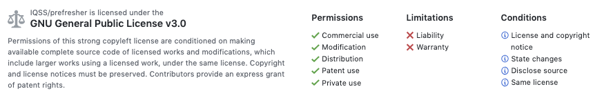

# Math Prefresher Text 

_(view this book on a browser: https://iqss.github.io/prefresher/)_

The [__Harvard Gov Prefresher__](https://projects.iq.harvard.edu/prefresher) is held each year in August. All relevant information is on our website, including the [day-to-day schedule](https://projects.iq.harvard.edu/prefresher/schedule). The 2019 Prefresher instructors are [Shannon Parker](https://wcfia.harvard.edu/shannon-lynn-parker) and [Meg Schwenzfeier](http://schwenzfeier.github.io/), and the faculty sponsor is  [Gary King](https://gking.harvard.edu). The booklet maintained in this repository is the text for the Prefresher. Shiro Kuriwaki ([kuriwaki](https://github.com/kuriwaki)) is the repository maintainer. 

This material is maintained under a GPL License.

## How the book is compiled

The text for the book is originally written in RMarkdown following the `bookdown` template, which allows interweaving prose and code. RMarkdown is converted into markdown (with generated code output) and again converted into a book by pandoc. Two formats are provided: a HTML version and a PDF (generated by TeX). The HTML version is hosted on a website listed above. 

The repository is also associated with a set of scripts that automatically compiles and deploys the new book to the URL (https://iqss.github.io/prefresher/).  Here is basically how it works:

1. A [Travis-CI app](https://travis-ci.org/IQSS/prefresher) is linked to this repository. The `.travis.yml` file in the repository is what Travis runs. 
2. First, Travis creates a virtual machine, downloads all the materials on the `master` branch of the repository, starts a R session, and installs the R packages listed in `DESCRIPTION`. 
3.Then, according to the `.travis.yml` file, Travis runs the shell scripts `_build.sh`. This compiles the Rmd files and images into a html book format (in the virtual machine). 
4. Then, Travis runs the second script, `_deploy.sh`. This shell script clones the `gh-pages` branch of the repo into a _sub-directory_ of the repository (called `book-deploy`). Then, it removes the content of that cloned copy and then copies the compiled html (in `_book`) into `book-deploy`. It tracks that contents of `book-deploy` and pushes it back up to the `gh-pages branch`.
5. The repository is separately setup with Github Pages, which is designed to notice any `index.html` and associated html files in the `gh-pages` branch and upload the html into a book format at https://iqss.github.io/prefresher/. 
6. Every time a commit is pushed to a branch, it will trigger Travis to run procedures 1 through 6. This is the same for pull requests to merge those branches into master. Travis will check beforehand if the merged branch will compile. This is useful to test out the compilation in the cloud before you alter master. 

_This system follows the guidelines outline in the [bookdown manual](https://bookdown.org/yihui/bookdown/github.html)._

